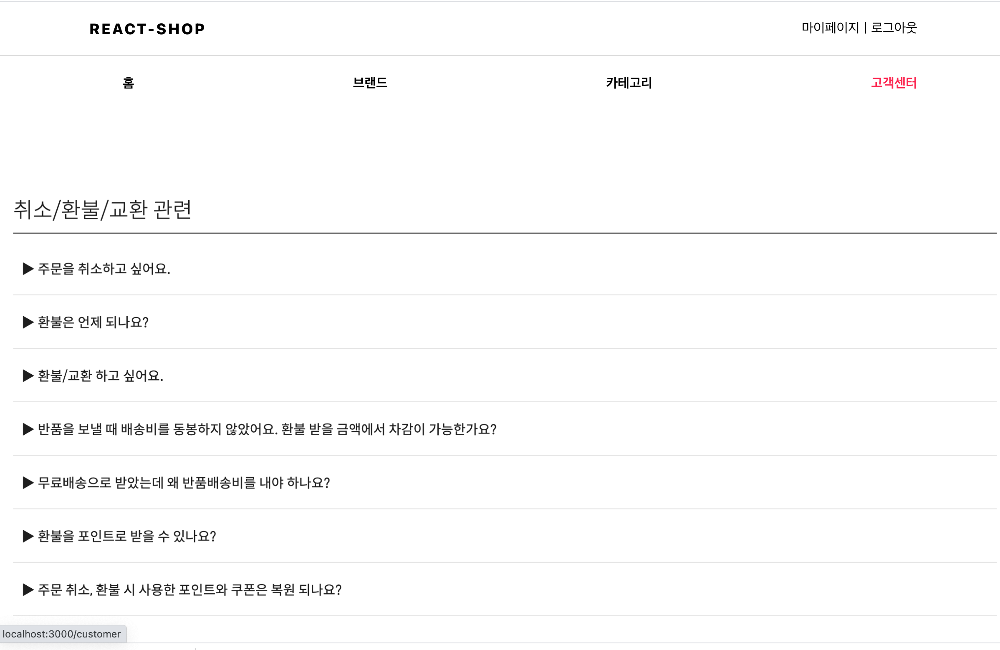

## 스터티 과제

> 참고 사이트  :https://www.brandi.co.kr/

1. 쇼핑몰 메인화면 제작 진행 프로세스
    - [x] gnb 기능 및gnb 클릭시 메인화면 바뀌기
    - [x] 로그인 + 회원가입 
    - [x] 소셜 로그인
2. 구현 동영상

3. 구현 상세
    - 초기 화면 
        - 
- Header:
        - 
        -  상단: 로고, 로그인 
        -  하단 : 홈,브랜드,카테고리,고객 센터 메뉴

    - 로그인
        - 
        - local 로그인(이미 구현되어 있었음)
        - 소셜 로그인(firebase 인증)
    - 회원가입
        - 

    - 로컬 로그인
        - 
      
    - 소셜 로그인
        - 구글 로그인
            - 
        - 카카오 로그인
            - 
    - 로그인 후 메인으로 리다이렉션 화면
        - 
    - 메인 및 홈 페이지
        - 
    - 브랜드 페이지
        - 
    - 카테고리 페이지
        - 
    - 고객센터 페이지
        - 
        

  